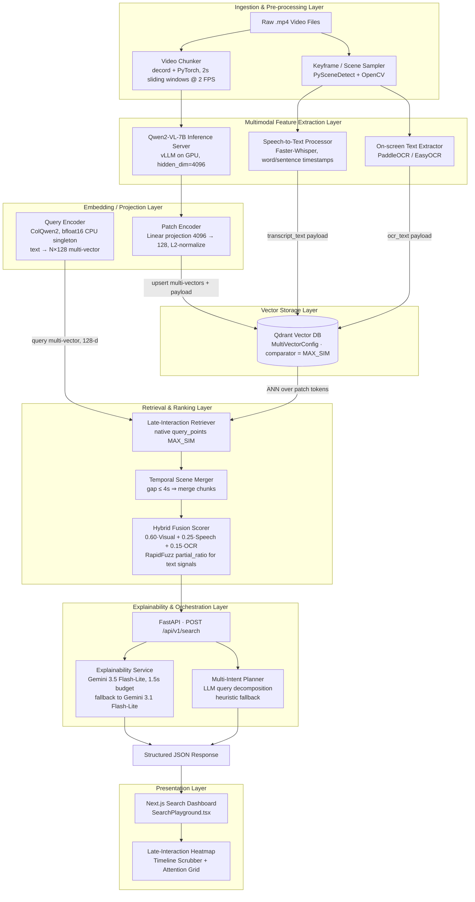

# ChronoVision AI — Technical Architecture & Audit Report
### Repo: `aaryanmax/sih` (Smart India Hackathon — Multimodal Video Search Engine)

---

## 1. Executive Summary

ChronoVision AI is a **late-interaction, patch-level multimodal video search engine**. Instead of compressing a video frame into one vector (the way traditional semantic video search tools work), it maintains a *matrix* of vectors per frame — one per visual patch — and scores queries token-by-token against that matrix (the ColPali/ColBERT paradigm). This visual signal is fused with speech transcripts and on-screen OCR text, allowing retrieved moments to be grounded in what is **seen, heard, and read** in the video stream.

The system is a **6-layer pipeline**: ingestion → multimodal feature extraction → embedding/projection → vector storage → retrieval/ranking → explainability/orchestration → presentation. It is implemented as a polyglot monorepo (Python 3.14 / FastAPI backend + GPU inference service + TypeScript / Next.js 14 frontend), containerized via Docker Compose.

---

## 2. Tech Stack

| Layer | Technology | Repository Path |
|---|---|---|
| Frontend | React 18, Next.js 14, Node.js 24, TypeScript, Tailwind CSS, `lucide-react` | `apps/web/` |
| Backend API | FastAPI (Python 3.14), Pydantic v2, Uvicorn | `apps/api/` |
| GPU Inference | vLLM, Qwen2-VL-7B-Instruct, PyTorch, `decord` | `packages/vlm_engine/` |
| Embeddings | `colpali-engine` (ColQwen2 + ColQwen2Processor), NumPy, PyTorch (bfloat16, CPU) | `packages/embeddings/` |
| Vector Database | Qdrant v1.14.0, native `MultiVectorConfig(comparator=MAX_SIM)` | `docker-compose.yml`, `packages/retrieval/`, `packages/late_interaction/` |
| Speech-to-Text | Faster-Whisper (word and sentence timestamp extraction) | `packages/audio_ocr/whisper_processor.py` |
| OCR | PaddleOCR / EasyOCR on extracted keyframes | `packages/audio_ocr/ocr_processor.py` |
| Scene Detection | PySceneDetect + OpenCV temporal frame sampling | `packages/audio_ocr/frame_sampler.py` |
| LLM Explainability & Planning | Google `google-genai` SDK, **Gemini 3.5 Flash-Lite** (fallback: **Gemini 3.1 Flash-Lite**) | `apps/api/services/explainability.py`, `packages/multi_search/planner.py` |
| Lexical Re-ranking | RapidFuzz (`partial_ratio`) | `apps/api/routes/search.py` |
| Orchestration | Docker Compose, Makefile, GitHub Actions CI/CD | root, `.github/workflows/ci.yml` |
| Tooling | Ruff, Black, Pyright, ESLint | `pyproject.toml`, `apps/web/package.json` |

---

## 3. System Architecture — Layered Flowchart



---

## 4. Mathematical Basis of Ranking

### 4.1 Core Operator: MaxSim Late Interaction

Given a query encoded as token embeddings $Q = \{q_1, \dots, q_n\}$ and a document/frame encoded as patch embeddings $D = \{d_1, \dots, d_m\}$, both in $\mathbb{R}^{128}$ and L2-normalized, the relevance score is:

$$\text{Score}(Q, D) = \sum_{i=1}^{n} \max_{j=1}^{m} (q_i \cdot d_j)$$

Implementation:
```python
similarity_matrix = np.dot(q_norm, d_norm.T)  # (n, m) cosine similarities
max_sim_per_token = np.max(similarity_matrix, axis=1)  # best patch per query token
total_score = float(np.sum(max_sim_per_token))
```

### 4.2 Hybrid Modality Fusion

The production ranking formula dynamically weights visual, acoustic, and OCR evidence:

$$\text{FusedScore} = 0.60 \cdot \text{Score}_{\text{Visual}} + 0.25 \cdot \text{Score}_{\text{Whisper}} + 0.15 \cdot \text{Score}_{\text{OCR}}$$

If both speech and OCR are absent (e.g., silent or purely visual video segments), $\text{FusedScore} = \text{Score}_{\text{Visual}}$ natively.

---

## 5. Architectural Hardening & Resolution of Prior Findings

All critical architectural inconsistencies identified during initial audits have been resolved:
1. **Unified Qdrant Collection**: Standardized across the entire repository to `video_frames` with vector field `colqwen`.
2. **Harmonized Fusion Weights**: Standardized to `Visual=0.60, Speech=0.25, OCR=0.15` in `apps/api/config.py` and retrieval modules.
3. **Strict Dual-Model Fallback**: Hardened all LLM endpoints to strictly use **Gemini 3.5 Flash-Lite** (primary) and **Gemini 3.1 Flash-Lite** (automatic circuit breaker fallback).
4. **Isolated Docker Builds**: Added [`.dockerignore`](../.dockerignore) to prevent host artifacts (`node_modules`) from interfering with container compilation.
5. **Modernized Runtime Environment**: Upgraded to **Python 3.14** and **Node.js 24 LTS**.
